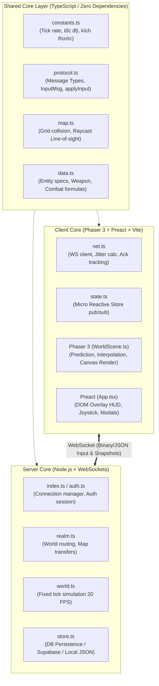
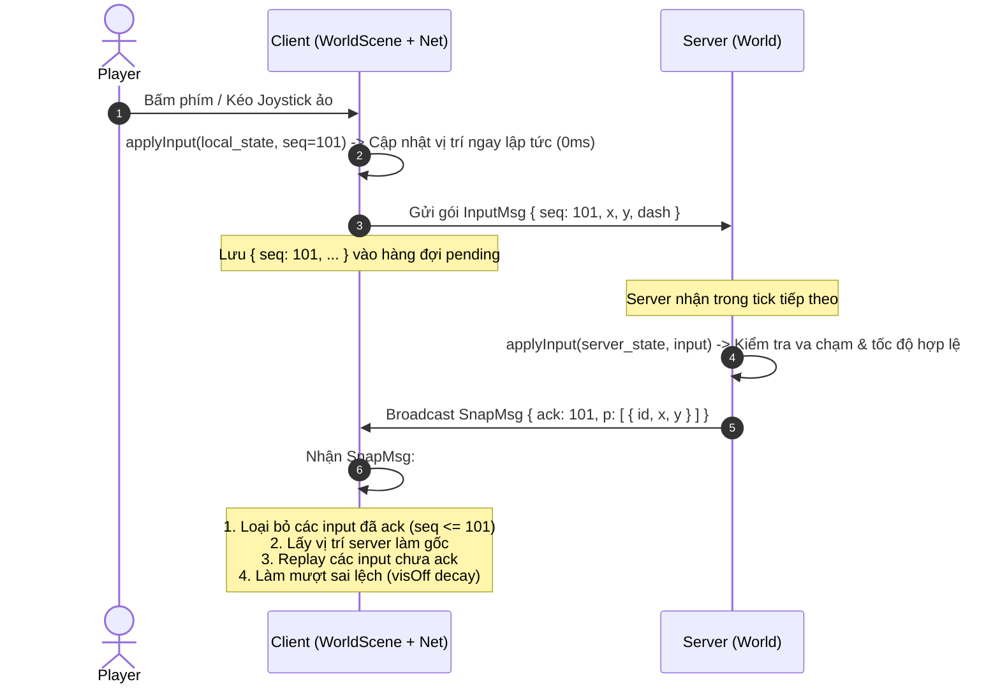
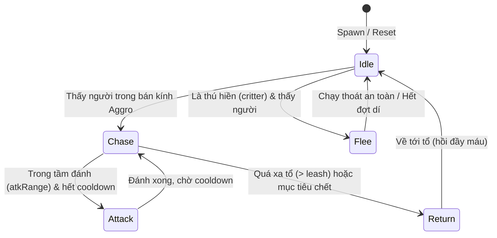

# Kiến Trúc Core Game Engine (Client-Server Authoritative 2D MMO)

Tài liệu này bóc tách toàn bộ **kiến trúc cốt lõi (Core Engine Architecture)** của dự án, loại bỏ hoàn toàn các yếu tố về cốt truyện/nhiệm vụ/lore để phục vụ việc **clone, tái sử dụng và phát triển một gameplay hoàn toàn mới** (Action RPG, Survival, Farming Sim, Battle Royale 2D, v.v.).

---

## 1. Tổng Quan Kiến Trúc (Architecture Overview)

Dự án sử dụng mô hình **Client-Server Authoritative** (Server làm chuẩn, quyết định toàn bộ logic; Client chỉ dự đoán, gửi input và hiển thị hình ảnh):



### Ưu điểm của kiến trúc này:
1. **Chống gian lận (Anti-cheat)**: Server quyết định vị trí thật, sát thương, máu, rơi đồ, vật phẩm. Client không thể sửa memory để dịch chuyển tức thời hoặc hack một đòn chết quái.
2. **Dự đoán mượt mà (Client-Side Prediction)**: Người chơi di chuyển phản hồi ngay lập tức (0 latency), server gửi xác nhận (`ack`) và client tự bù trừ sai lệch (reconciliation).
3. **Nội suy thích ứng (Adaptive Snapshot Interpolation)**: Tự động co giãn bộ đệm gói tin dựa theo jitter mạng, đảm bảo nhân vật và quái di chuyển mượt mà không bị giật lag kể cả qua đường hầm (Cloudflare Tunnel).
4. **Shared Simulation Logic**: Hàm tính toán va chạm và di chuyển `applyInput()` được chia sẻ 100% giữa Client và Server mà không phải viết lại 2 lần.
5. **Headless Unit Testing**: Toàn bộ thế giới game mô phỏng được độc lập không cần mở mạng, chạy test hàng trăm scenario trong < 2 giây.

---

## 2. Tech Stack & Phiên Bản Thư Viện (Library Versions)

Toàn bộ dự án được thiết kế theo tư duy **Zero-Bloat** (tối giản thư viện, ưu tiên tính năng native của runtime và thư viện nhỏ nhẹ nhất có thể):

### 2.1. Server Tech Stack (`server/package.json`)

| Thư viện / Công cụ | Phiên bản | Mục đích & Lý do lựa chọn |
|---|---|---|
| **Node.js Runtime** | `>= 22.6` (đang chạy `v22.14.0`) | Hỗ trợ cờ `--experimental-strip-types`, cho phép **chạy trực tiếp TypeScript (`.ts`) natively** mà không cần `ts-node`, `tsx`, `esbuild` hay cấu hình compile phức tạp. |
| **`ws`** | `^8.18.0` | Thư viện WebSocket thuần (raw WS) nhẹ nhất và có hiệu năng truyền tải gói tin cao nhất trong hệ sinh thái Node.js (nhẹ và nhanh hơn nhiều so với Socket.io). |
| **`@supabase/supabase-js`** | `^2.117.2` | SDK PostgreSQL / Auth đám mây để lưu trữ profile nhân vật lâu dài. |
| **`node:test` & `node:assert/strict`** | *Built-in Node.js* | Bộ kiểm thử tích hợp sẵn của Node.js, không cần cài thêm Jest hay Mocha, chạy 54 tests trong < 2 giây. |

> **Scripts khởi chạy Server:**
> - `npm run dev`: `node --experimental-strip-types --disable-warning=ExperimentalWarning --watch src/index.ts`
> - `npm test`: `node --experimental-strip-types --disable-warning=ExperimentalWarning --test test/sim.test.ts ...`

---

### 2.2. Client Tech Stack (`client/package.json`)

| Thư viện / Công cụ | Phiên bản | Mục đích & Lý do lựa chọn |
|---|---|---|
| **`phaser`** | `^3.90.0` | Game Engine 2D Canvas/WebGL hàng đầu trên web. Đảm nhiệm việc render thế giới, camera lerp, particle FX, quản lý texture và animation. |
| **`preact`** | `^10.26.0` | Thay thế cho React với dung lượng siêu nhẹ (~3KB gzip). Đảm nhiệm render lớp giao diện DOM (HUD, joystick ảo, túi đồ, hội thoại, modal) phủ lên trên canvas mà không làm tụt FPS game. |
| **`vite`** | `^6.3.0` | Công cụ build frontend và Dev Server HMR (Hot Module Replacement) thế hệ mới, khởi động cực nhanh và đóng gói tối ưu. |
| **`@preact/preset-vite`** | `^2.10.0` | Plugin Vite chính thức hỗ trợ JSX/TSX của Preact và Fast Refresh. |
| **`typescript`** | `^5.8.0` | Trình kiểm tra kiểu tĩnh (Static Type Checking) giúp bảo đảm an toàn dữ liệu giữa Client và Server. |

> **Scripts chạy Client:**
> - `npm run dev`: Chạy Vite dev server tại cổng `5173`.
> - `npm run build`: Đóng gói production ra thư mục `dist/`.
> - `npm run typecheck`: `tsc --noEmit` kiểm tra toàn bộ lỗi kiểu dữ liệu.

---

### 2.3. Shared Layer (`shared/`)

- Không phụ thuộc bất kỳ thư viện bên thứ 3 nào (**Zero Dependencies**).
- 100% là Vanilla TypeScript Interfaces, Types, Math functions (`moveWithCollision`, `lineOfSight`, `applyInput`).
- Nhúng trực tiếp vào cả Server và Client thông qua ES Module import: `import ... from '../../shared/protocol.ts'`.

---

## 3. Cấu Trúc Thư Mục Mẫu Khi Clone

```
game-core/
├── shared/                     # Mã nguồn dùng chung giữa Client và Server
│   ├── constants.ts            # Hằng số vật lý: TICK_MS (50ms = 20 FPS), kích thước ô, bán kính...
│   ├── protocol.ts             # Định nghĩa toàn bộ gói tin WS (ClientMsg, ServerMsg, Snapshots)
│   ├── map.ts                  # Thuật toán bản đồ: Grid matrix, va chạm, portal, line-of-sight
│   └── data.ts                 # Định nghĩa dữ liệu gốc: class nhân vật, chỉ số, công thức dame
├── server/                     # Máy chủ Game Authoritative
│   ├── src/
│   │   ├── index.ts            # Entrypoint HTTP/WS, ping/pong, chống spam packet
│   │   ├── realm.ts            # Quản lý đa bản đồ (Map Instances) và chuyển map
│   │   ├── world.ts            # TRÁI TIM CỦA GAME: Vòng lặp tick, AI quái, combat, nhặt đồ
│   │   ├── auth.ts             # Xác thực token/session không trạng thái
│   │   └── store.ts            # Lớp lưu trữ profile (hỗ trợ DB thật hoặc file JSON offline)
│   └── test/
│       ├── sim.test.ts         # Test headless mô phỏng logic game không cần mạng
│       └── realm.test.ts       # Test chuyển bản đồ, qua cổng
└── client/                     # Máy khách Web (Phaser 3 + Preact)
    ├── src/
    ├── main.tsx                # Bootstrap Preact DOM overlay lên trên canvas Phaser
    ├── net.ts                  # Lớp mạng WebSocket, tính toán độ trễ, giải mã gói tin
    ├── state.ts                # Reactive Store mini (cầu nối trực tiếp giữa Phaser & Preact)
    ├── actions.ts              # Các hàm gửi lệnh (move, skill, use item, interact)
    ├── game/
    │   ├── start.ts            # Khởi tạo Phaser.Game với responsive viewport (Mobile Portrait/Landscape)
    │   ├── WorldScene.ts       # Scene chính: Prediction, Interpolation, Render entity & visual FX
    │   ├── textures.ts         # Texture generator runtime (Graphics-based hoặc spritesheet)
    │   └── sprites/            # Hệ thống Sprite, Animation & Frame packing
    └── ui/
        ├── App.tsx             # Giao diện HUD: Joystick ảo, máu/mana, nút chiêu, túi đồ
        └── styles.css          # CSS responsive, an toàn cho tai thỏ/safe-area trên điện thoại
```

---

## 4. Hệ Thống Mạng & Đồng Bộ (Networking & State Sync)

### 4.1. Vòng đời gói tin Input & Dự đoán Client (Client-Side Prediction)



- **Xử lý Input Spam/Speedhack**:
  - Server sử dụng cơ chế Token Bucket: tối đa ~3 gói input/tick và tối đa 60 gói/giây. Nếu client gửi dồn 100 gói một lúc để hack speed, các gói vượt ngưỡng sẽ bị drop.
  - Vị trí tính toán trên server sử dụng `effSpeed * dt` giới hạn khoảng cách tối đa có thể đi được trong 1 tick.

### 4.2. Nội suy trạng thái Snapshot thích ứng (Adaptive Snapshot Interpolation)

Server broadcast snapshot định kỳ (mỗi `SNAP_EVERY` tick, ví dụ mỗi 2 tick = 100ms một lần). Để chuyển động của người chơi khác và quái vật mượt mà ở 60 FPS:
- Client duy trì mảng `snaps: Buffered[]`.
- Điểm thời gian render: `renderT = clientNow + offset - interpDelay`.
- Thuật toán tự điều chỉnh độ trễ `interpDelay` theo jitter mạng:
  ```ts
  const late = this.offset - o;
  this.jitter = late > this.jitter ? late : this.jitter * 0.98 + late * 0.02;
  this.interpTarget = Phaser.Math.Clamp(snapGap + this.jitter + 30, MIN_DELAY, MAX_DELAY);
  this.interpDelay += (this.interpTarget - this.interpDelay) * Math.min(1, delta * rate);
  ```
- Nhờ cơ chế này, game chạy mượt qua cả kết nối 4G không ổn định mà không bị giật lùi hình.

---

## 5. Cấu Trúc Máy Chủ Game (Authoritative Server)

### 5.1. Vòng lặp cố định (Fixed Tick Loop)
Server chạy theo chu kỳ `setInterval` chuẩn hóa (`TICK_MS = 50ms` tương ứng 20 tick/giây):

```ts
// server/src/world.ts
tick() {
  this.t += TICK_MS;
  // 1. Chạy các tác vụ hoãn lại (Delayed timers)
  // 2. Cập nhật Player: dequeue input -> applyInput -> hồi máu/mana -> auto combat
  // 3. Cập nhật Quái (Mob AI): idle -> chase -> attack -> return / flee
  // 4. Cập nhật Đạn bay (Projectiles): move -> check AABB hit -> AOE dmg -> TTL
  // 5. Cập nhật Rơi đồ (Drops): TTL biến mất, kiểm tra bán kính nhặt đồ
  // 6. Xử lý Trigger (Cổng chuyển bản đồ, vùng an toàn, bẫy)
  // 7. Tạo Snapshot định kỳ gửi về outbox
}
```

### 5.2. Máy Trạng Thái Quái Vật (Mob State Machine)
Mô hình AI quái vật dạng Data-Driven trong `world.ts`:



- **Thú hiền (Critter AI)**: Bỏ chạy khỏi người chơi gần nhất, có thanh thể lực (chạy ~1.5s thì đuối sức dừng nghỉ 0.8s) để người chơi cận chiến vẫn đuổi kịp.

### 5.3. Quản lý Đa Bản Đồ (Multi-Map Realm)
Lớp `Realm` (`server/src/realm.ts`) đóng vai trò quản lý nhiều `World`:
- Mỗi `World` là một bản đồ độc lập (`lang_tre`, `dam_sen`, `dungeon_01`, `arena`...).
- Bộ cấp phát ID nhân vật và quái (`ids()`) dùng chung ở cấp Realm để đảm bảo không bao giờ trùng ID khi chuyển map.
- Khi bước vào cổng `portal`: Player được `detachPlayer()` từ World cũ, đồng bộ mốc cooldown lệch thời gian, rồi `attachPlayer()` vào World mới tại toạ độ chỉ định.

---

## 6. Động Cơ Bản Đồ & Va Chạm (Physics & Map Collision)

### 6.1. Grid Matrix & Collision Resolution
Bản đồ được biểu diễn dưới dạng mảng 1D / 2D các tile số nguyên (`Uint8Array` hoặc `number[][]`):
- `TILE = 32px` (kích thước ô).
- Kiểm tra va chạm hình tròn nhân vật với các ô chắn (Blocks):
  ```ts
  // Kiểm tra 4 góc bounding box tròn của nhân vật
  function collides(map: GameMap, x: number, y: number, radius: number): boolean
  ```
- **Trượt men theo tường (Sliding)**: Khi nhân vật đi chéo va vào tường, thuật toán tách vector di chuyển thành trục X và trục Y riêng biệt. Nếu hướng X bị cản, vẫn cho phép trượt theo hướng Y (và ngược lại), giúp cảm giác điều khiển mượt mà, không bị khựng lại.

### 6.2. Đường Ngắm & Tầm Nhìn (Line of Sight)
Thuật toán Raycasting bước nhảy ngắn (`step = 16px`) kiểm tra đường ngắm giữa 2 điểm `(x1, y1)` và `(x2, y2)`:
- Quái vật chỉ tấn công hoặc đuổi theo nếu không bị tường/chướng ngại vật che khuất.
- Cung thủ/Phép thuật không bắn xuyên qua tường đá.

---

## 7. Cấu Trúc Client (Phaser 3 + Preact Hybrid)

Sự kết hợp giữa **Phaser 3 (Canvas)** và **Preact (DOM UI)** mang lại hiệu năng cao nhất:

| Thành phần | Công nghệ | Nhiệm vụ |
|---|---|---|
| **Viewport / Canvas** | Phaser 3 | Render bản đồ, Camera cuộn, Sprite nhân vật/quái, Particle hiệu ứng, Cần câu, Bẫy |
| **HUD / Touch UI** | Preact (DOM) | Thanh máu/mana, Joystick ảo cảm ứng, Nút bấm kỹ năng, Túi đồ, Hộp thoại NPC, Chat |
| **State Bridge** | `client/src/state.ts` | Micro pub/sub store siêu nhẹ: Phaser đẩy sự kiện vào store, Preact render lại UI tức thì mà không cần Redux/Zustand cồng kềnh |

### Cơ chế Virtual Joystick di động
- Bắt trực tiếp trên DOM bằng Touch Event / Pointer Event (`client/src/ui/App.tsx`).
- Ghi đè vào biến toàn cục `controls = { x, y, dash }`.
- Phaser đọc biến này trong hàm `stepInput()` mỗi tick để tính toán di chuyển (không đi qua React state để tránh re-render thừa).

---

## 8. Hướng Dẫn Clone & Xây Dựng Gameplay Mới

Nếu bạn muốn dùng khung sườn này để làm một game khác:

### Bước 1: Giữ nguyên Core Engine (Không cần sửa)
1. `server/src/index.ts` (Hệ thống WebSocket, kết nối, ping/pong).
2. `server/src/realm.ts` (Hệ thống điều phối map).
3. `server/src/store.ts` (Lớp trừu tượng hoá DB / Local JSON).
4. `client/src/net.ts` (Xử lý mạng, jitter buffer).
5. `client/src/game/start.ts` (Responsive canvas scaling).
6. Thuật toán `moveWithCollision`, `lineOfSight` trong `shared/map.ts`.

### Bước 2: Tùy biến Gameplay (Các file cần sửa)
1. **Thiết kế thuộc tính & thực thể (`shared/data.ts`)**:
   - Thay đổi các Class nhân vật, chỉ số (HP, Mana, Atk, Def, Speed).
   - Định nghĩa danh sách Quái vật / Boss mới và cơ chế đánh.
   - Định nghĩa trang bị, vũ khí, hiệu ứng.
2. **Thiết kế bản đồ (`shared/map.ts`)**:
   - Thay thế ma trận map bằng thuật toán sinh map ngẫu nhiên (Procedural generation) hoặc đọc từ file JSON của Tiled Map Editor.
   - Đặt lại toạ độ Spawn, Portal, Safe Zone.
3. **Mở rộng giao thức nếu có cơ chế mới (`shared/protocol.ts`)**:
   - Thêm gói tin hành động client: `{ t: 'use_item', id }`, `{ t: 'craft', recipe }`...
   - Thêm sự kiện server: `{ e: 'fx', k: 'explosion' }`...
4. **Viết logic xử lý trong `server/src/world.ts`**:
   - Đặt logic trong switch-case của hàm `handle()`.
   - Cập nhật hàm `tick()` cho các cơ chế mới (ví dụ: vòng bo thu hẹp, cây trồng lớn lên theo thời gian, thời tiết).
5. **Vẽ giao diện & Sprite (`client/src/ui/` & `client/src/game/`)**:
   - Thêm texture hoặc spritesheet mới vào `client/src/game/textures.ts`.
   - Tạo các nút bấm hoặc bảng điều khiển mới trong Preact (`App.tsx`).

---

## 9. Lệnh Khởi Chạy & Kiểm Thử

- **Chạy máy chủ dev**:
  ```bash
  cd server && npm run dev
  ```
- **Chạy client dev**:
  ```bash
  cd client && npm run dev
  ```
- **Chạy toàn bộ Unit Test (Headless simulation, không cần mở client/mạng)**:
  ```bash
  cd server && npm test
  ```
- **Kiểm tra Typescript & Build Client**:
  ```bash
  cd client && npm run typecheck && npm run build
  ```
