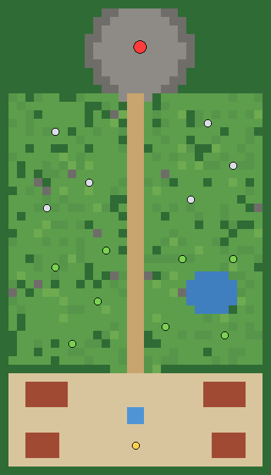

# Happy Land – Vùng đất Vui Vẻ — game nhập vai online màn hình dọc

Tài liệu cốt truyện & gameplay: xem doc "Happy Land – Vùng đất Vui Vẻ Cốt truyện & Gameplay".
Tài liệu art design (nhân vật, vũ khí, tuyệt chiêu, quái): xem doc "Happy Land — Art Design".

Bản thử để test gameplay: nhiều người cùng một map, đánh quái, rơi đồ, lên cấp, boss co-op.
Server quyết định mọi thứ (di chuyển, sát thương, rơi đồ); client chỉ gửi input và vẽ.

```
client/   Phaser 3 (vẽ game) + Preact (HUD, joystick, túi đồ, chat) — Vite
server/   Node 22 + ws, chạy TypeScript trực tiếp (--experimental-strip-types)
shared/   Dữ liệu game, map, công thức, giao thức — dùng chung 2 phía
```

## Chạy bằng Docker Desktop

```bash
docker compose up -d --build                    # mở http://localhost:8080
docker compose --profile quick up -d --build    # thêm link public tạm thời
docker compose logs tunnel-quick | grep trycloudflare   # lấy link gửi bạn bè
```

**Domain cố định (named tunnel):** Cloudflare Zero Trust → Networks → Tunnels → Create tunnel (Cloudflared) → copy token vào `.env` (xem `.env.example`) → thêm *Public Hostname* trỏ tới `http://web:80` → chạy `docker compose --profile named up -d --build`. Cloudflare Tunnel hỗ trợ WebSocket sẵn, không cần cấu hình thêm.

Dữ liệu nhân vật nằm trong Supabase (PostgreSQL), có cơ chế sao lưu cục bộ tại `server/data/`.

## Chạy dev (sửa code thấy ngay)

```bash
cd server && npm install && npm run dev     # :2567, tự restart khi sửa
cd client && npm install && npm run dev     # :5173, proxy /ws sang :2567
cd server && npm test                       # test mô phỏng combat/AI/loot không cần mạng
```

Mở trên điện thoại cùng wifi: `http://<IP-máy-tính>:5173`.

## Thiết kế gameplay (MVP)

**Vòng lặp chính:** vào Làng Tre → ra Rừng Đa đánh Bánh Trôi Tinh → lên cấp, nhặt đồ → sang bãi Cáo Tinh → rủ bạn đánh Chúa Mộc Tinh lấy vũ khí sử thi và Mảnh Trống Đồng.

**Điều khiển (một tay cầm dọc):** cần gạt bên trái để đi. Nhân vật **tự đánh thường** quái gần nhất trong tầm. Bên phải có 3 nút: chiêu môn phái (to), khinh công, bình máu. Máy tính dùng WASD, Space (khinh công), Q (chiêu), E (máu).

### Môn phái

| Môn phái | Máu | Công | Thủ | Tầm | Đánh thường | Chiêu (hồi) |
|---|---|---|---|---|---|---|
| **Thiết Kiếm Môn** | 150 | 12 | 6 | 46 | Chém cận chiến | **Quét Tre Ngà** — quét xoay vùng quanh mình, 180% (6s) |
| **Lạc Tiễn Cốc** | 105 | 10 | 3 | 200 | Bắn nỏ đuổi mục tiêu | **Nỏ Liên Châu** — 5 mũi tên hình quạt (5s) |
| **Thủy Phù Quán** | 90 | 14 | 2 | 175 | Cầu bùa nổ lan | **Lôi Phù** — sấm sét báo vùng 0.6s rồi nổ 250% (7s) |

Chung: **Khinh công** 90px, bất tử 0.3s (hồi 4s). **Bình máu** hồi 40% máu (hồi 3s). Mỗi cấp: +12% máu, +10% công, +0.8 thủ.

### Vũ khí (3 bậc mỗi môn phái)

| Môn phái | Thường (khởi đầu) | Hiếm (xanh) | Sử thi (tím, chủ yếu từ boss) |
|---|---|---|---|
| **Thiết Kiếm Môn** | Kiếm Tre | Kiếm Đồng Đông Sơn +6 | Roi Sắt Phù Đổng +14, đánh nhanh hơn |
| **Lạc Tiễn Cốc** | Nỏ Tre | Nỏ Đồng +5, tầm +25 | Nỏ Móng Rùa +12, tầm +30, đánh nhanh |
| **Thủy Phù Quán** | Quạt Giấy | Quạt Lông Hạc +7, nổ rộng hơn | Quạt Phong Lôi +16, nổ rộng |

Vũ khí rơi ra đúng môn phái của người gây nhiều sát thương nhất, được giữ riêng 10s rồi ai cùng môn phái cũng nhặt được. Nhặt đồ tốt hơn sẽ tự trang bị; đồ cũ vào túi (12 ô).

### Quái

| Quái | Cấp | Máu | Hành vi | Rơi |
|---|---|---|---|---|
| **Bánh Trôi Tinh** | 1 | 34 | Chậm, chỉ đuổi khi lại gần | vàng, 25% bình máu, 3% vũ khí hiếm |
| **Cáo Tinh** | 4 | 85 | Nhanh, cắn mạnh | vàng, 30% bình máu, 10% hiếm |
| **Chúa Mộc Tinh** (boss) | 8 | 1400 | **Rễ Đâm**: vòng đỏ báo trước 1.2s, phải khinh công né | 1 vũ khí sử thi + hiếm 50%, Mảnh Trống Đồng, hồi sinh 90s |

Quái có tầm phát hiện, đuổi tới giới hạn rồi quay về hồi đầy máu (chống kéo quái). XP chia đủ cho mọi người đã đánh và đứng gần (khuyến khích chơi chung).

### Map Vùng 1: Làng Tre & Rừng Đa Cổ (32×56 ô)



Làng Tre (dưới, an toàn, giếng làng hồi phục sinh lực) → rừng thưa có hồ (Bánh Trôi Tinh) → rừng sâu (Cáo Tinh) → Gốc Đa Cổ (Chúa Mộc Tinh). Map sinh bằng code với seed cố định nên client và server luôn khớp.

## Kỹ thuật mạng

- Server tick 20Hz, gửi snapshot 10Hz (JSON). Mỗi gói input = 50ms di chuyển, có số thứ tự.
- **Client prediction + reconciliation:** nhân vật mình di chuyển ngay khi bấm; khi snapshot về thì lấy vị trí server, chạy lại các input chưa được xác nhận, sai lệch được làm mượt dần.
- **Nội suy:** người khác, quái, đạn vẽ trễ 150ms giữa 2 snapshot để không giật.
- **Chống gian lận cơ bản:** token bucket input (không chạy nhanh hơn tốc độ cho phép dù gửi dồn), server tự kiểm tra tầm đánh, hồi chiêu, quyền nhặt đồ, trang bị đúng lớp, giới hạn 60 gói/giây và chat 1 tin/0.8s.

## Việc tiếp theo

1. Art thật: thay các texture vẽ bằng code trong `client/src/game/textures.ts` bằng spritesheet cùng key.
2. Map vẽ bằng Tiled thay cho `buildMap()`.
3. Đăng nhập + lưu trên Supabase (thay `server/src/store.ts`).
4. Party, cửa hàng ở làng, nhiệm vụ, thêm map và chuyển vùng.
5. Đổi snapshot JSON sang nhị phân + chỉ gửi thực thể ở gần khi đông người.
